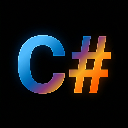

# CSharpSolution

  

管理 C# 项目（传统/SDK `.csproj`、`.sln`/`.slnx`）的 VS Code 扩展。

## 功能

- **项目管理面板** — 侧边栏「项目管理」视图，自动发现并展示项目
- **解决方案支持** — 解析 `.sln` / `.slnx`，按方案组织项目
- **项目浏览** — 展开查看引用（项目引用、程序集引用、NuGet 包、分析器）和源文件目录树
- **新增文件** — 右键「新增文件」子菜单：类 / 接口 / 枚举 / 结构体模板，自动注册到 `.csproj`
- **新建文件夹** — 传统项目写入 `<Folder>` 条目，空文件夹在树中可见（SDK 项目自动扫描空目录）
- **从项目排除** — 移除 `.csproj` 条目但保留物理文件（SDK 项目写 `Compile Remove`）
- **多选批量** — Ctrl 多选文件/文件夹批量删除、批量排除
- **链接条目** — `..\` 链接路径标记「→ 链接」，防误删共享文件
- **删除文件** — 右键删除文件/文件夹（或按 Delete 键），自动从 `.csproj` 移除条目，文件进回收站
- **重命名** — 右键重命名文件/文件夹（或按 F2 键），同步更新 `.csproj` 和 class 声明
- **拖拽移动** — 拖拽文件/文件夹到同项目的其他目录，自动更新 `.csproj`，同名冲突逐个询问
- **集成终端** — 右键节点 → 在集成终端中打开对应目录
- **添加现有文件/项目** — 将现有文件加入项目，或将项目加入解决方案
- **构建集成** — 右键项目/方案 → 生成、清理、重新生成；`buildTool` 配置支持 dotnet / MSBuild（vswhere 自动探测），传统项目自动选 MSBuild
- **构建配置切换** — 状态栏显示 Debug/Release，点击切换，持久化到工作区
- **诊断装饰** — C# 扩展的错误/警告数显示在项目节点上（有错误红图标 `✕ N`，仅警告黄图标 `⚠ N`）
- **VCS 集成** — 右键 TortoiseSVN / TortoiseGit 菜单，自动探测安装路径；支持 git/svn 状态装饰
- **复制文件路径** — 右键文件 → 复制绝对路径到剪贴板
- **新增项目** — 方案右键 → 选模板创建新项目并加入方案
- **文件资源管理器** — 右键节点 → 在系统文件管理器中定位
- **SDK 项目** — 支持 `<Project Sdk="...">` 格式，自动 glob 文件列表
- **自动刷新** — 监听文件变化，面板自动更新

## 国际化

命令面板同时支持中英文检索。安装中文语言包后，命令显示为中英双语（如 `切换解决方案` / `Switch Solution`）。

## 配置

| 配置项 | 类型 | 默认值 | 说明 |
|--------|------|--------|------|
| `csharpsolution.vcs` | `string` | `"git"` | 版本控制系统（`git` / `svn` / `none`） |
| `csharpsolution.buildTool` | `string` | `"auto"` | 构建工具（`auto` / `dotnet` / `msbuild`） |
| `csharpsolution.msbuildPath` | `string` | `""` | MSBuild.exe 路径（留空自动探测） |
| `csharpsolution.tortoiseSvnPath` | `string` | `""` | TortoiseProc.exe 路径（SVN，留空自动探测） |
| `csharpsolution.tortoiseGitPath` | `string` | `""` | TortoiseGitProc.exe 路径（Git，留空自动探测） |
| `csharpsolution.excludePatterns` | `string[]` | `[]` | 额外的排除 glob 模式 |
| `csharpsolution.defaultNamespace` | `string` | `""` | 默认根命名空间（留空使用项目名） |
| `csharpsolution.renameSyncCode` | `boolean` | `true` | 重命名时自动更新 class 声明 |

## 要求

- VS Code 1.93.0 及以上
- dotnet CLI（构建功能需要）
